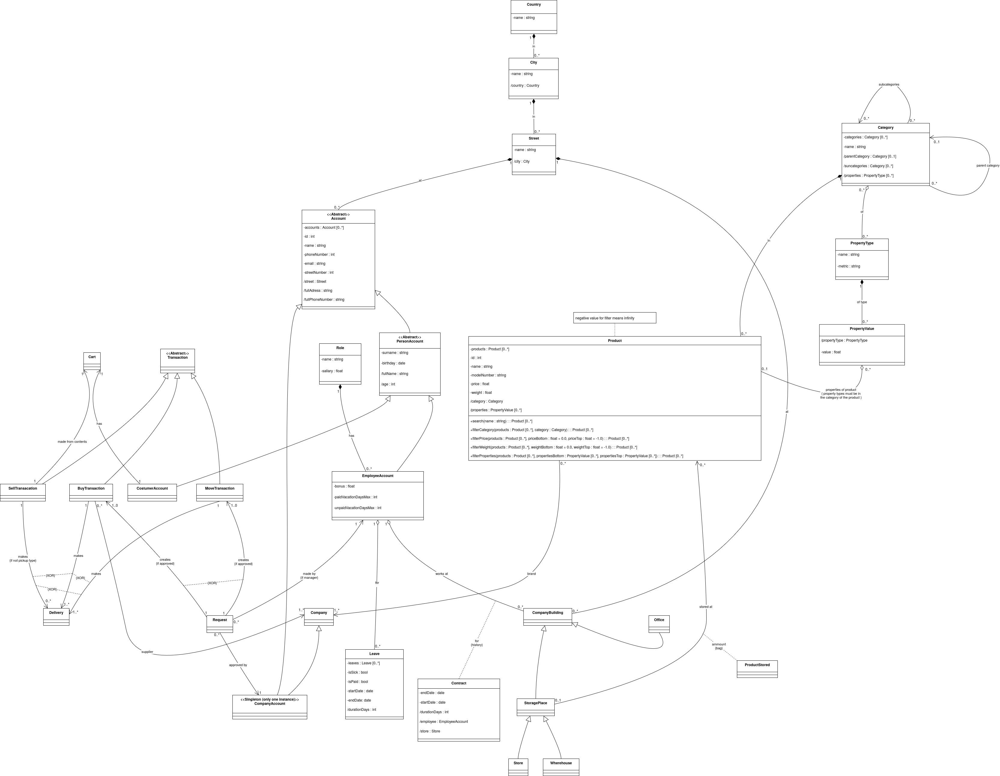

# User Requirements
The company seeks to implement an integrated information system that manages products, employees, customers, transactions, logistics, and company infrastructure. The system must serve both internal employees and external customers to ensure smooth product distribution, accurate tracking of financial operations, and clear monitoring of warehouse and delivery processes.

The system connects company buildings, warehouses, offices, and stores, allowing employees to perform their duties efficiently while ensuring customers can make purchases and receive deliveries on time. All entities such as products, categories, properties, and accounts are maintained within a centralized database, ensuring data consistency and traceability across operations.

Every person in the system (employee or customer) includes personal details such as name, surname, email, birth date, address, phone number. Each person is associated with a street wich belong to a city in a country, ensuring accurate geographical classification. Employees have defined roles (e.g., Manager, Clerk, Delivery Staff), a salary and an employment date. Each employee is linked to one or more company buildings (office, warehouse, or store) where they work. Employees can access and manage orders, deliveries, and repairs, depending on their assigned role. Their login credentials and work information are stored in their employee accounts. Customers can browse products, create transactions, and request deliveries. A customer owns one or more accounts used to perform online or in-store purchases. Customers’ details, transaction history, and delivery addresses are maintained within their account profile. 

Each product has a unique ID, name, price, weight, model number, stock quantity and belongs to one or more categories. Products also have associated property values, defining characteristics such as color, size, or material. A product’s stock level is updated automatically when items are sold, returned or restocked. Products can be linked with other products (e.g., accessories or similar models) through self-association. Products are organized hierarchically through categories (e.g., electronics - smartphones - accessories). Each category can contain subcategories and be part of a larger parent category. Categories define the allowed property types for their products. A property type holds the attribute’s name, and each product instance stores a property value.

All transaction types (sell, buy, move) contain detailed information such as the date, total amount, payment method, and the accounts involved in the operation. Once the transaction is finalized, the system automatically updates the product stock to reflect the transaction and records the corresponding financial data in the company’s account, ensuring that revenue and inventory remain synchronized. 

The company owns multiple buildings, which may serve as offices, stores or warehouses. Each building stores address, city, country, type (warehouse, office, or store), list of employees working there. Warehouses store the stock of products and manage inventory movement. Offices handle administration and financial operations. Stores serve customers directly for purchases or returns. Delivery of the product handles the logistics of transferring products from warehouses to stores or customers. Each delivery record includes delivery date, responsible employee, associated transaction or customer order, status (in preparation, in transit, delivered). The system ensures that deliveries are only created for completed and paid transactions. .....

# Diagram

